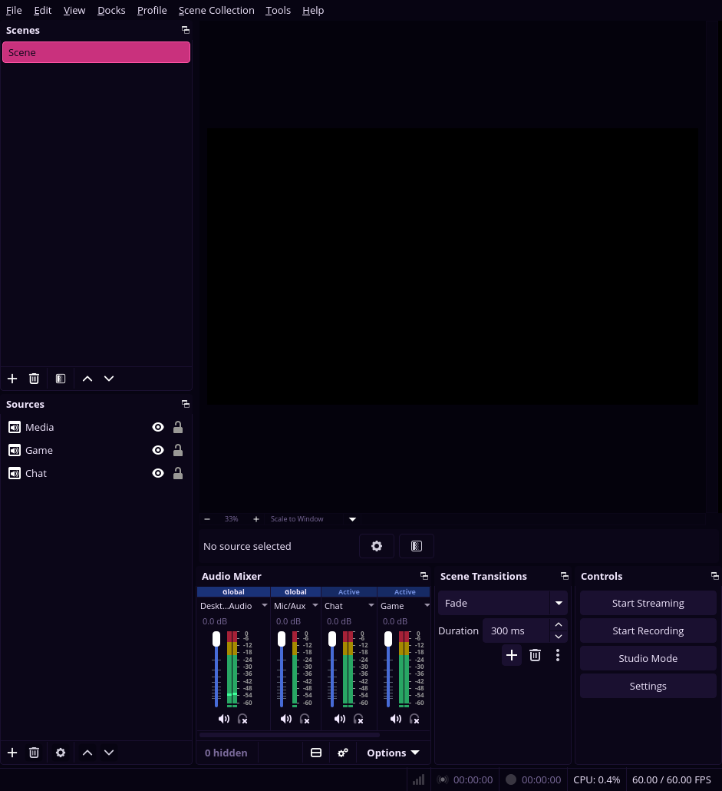
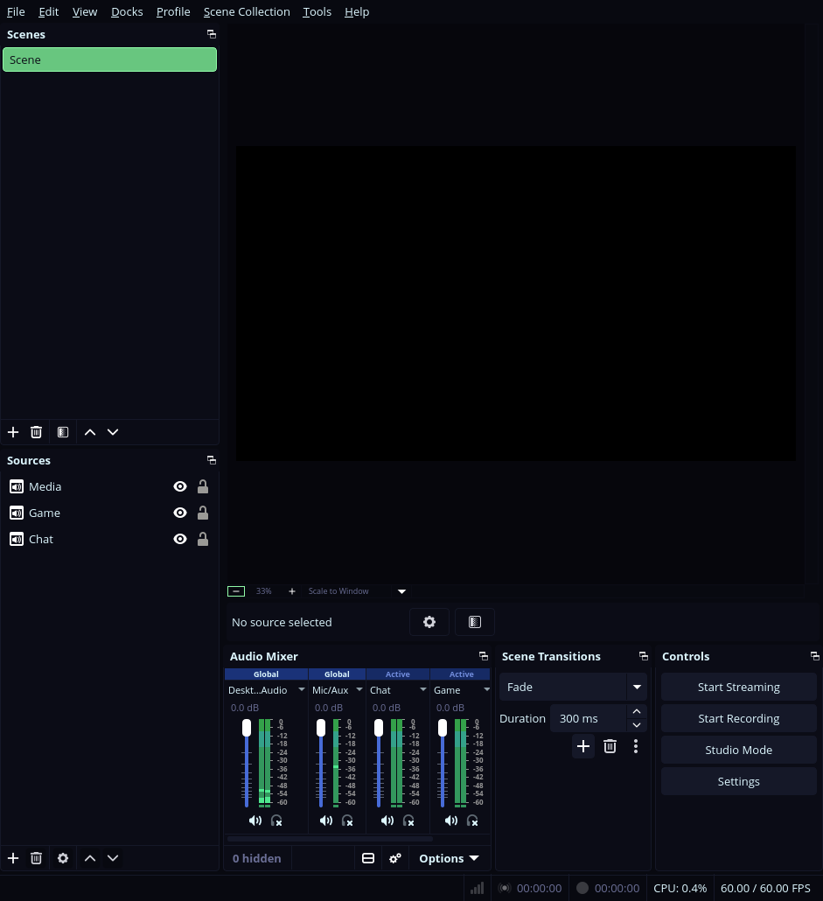
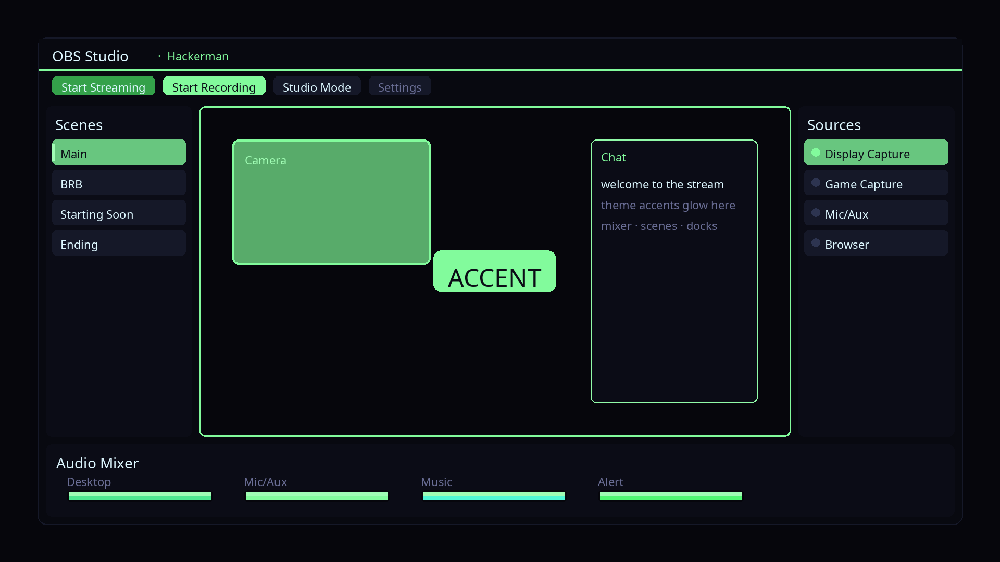

# OmaOBS

**Omarchy themes your desktop. OmaOBS carries the same palette into OBS Studio —
mockup previews in the Style menu, then a real Yami variant OBS can load.**



Stock Omarchy paints Hyprland, the terminal, and your GTK apps. OBS keeps its
own skin. Your desktop wears Hackerman neon; the encoder wears default grey.

OmaOBS closes that gap the same way Style → Unlock works for Plymouth: a
labelled image picker, one mockup per installed theme, and an apply step that
writes what OBS understands. Pick once, or let `omarchy theme set` keep OBS in
lockstep forever after.

## Goals (and honest limits)

These Style plugins extend Omarchy’s theme system **without requiring theme
authors — or you — to ship anything extra**. Official themes, your forks, and
third-party installs all work as long as they have a `colors.toml`. That
“every theme” contract is intentional: once the desktop can follow farther,
making *another* theme is more worth it. Longer origin story, stop-line, and
marketplace notes live in [Chroma](https://github.com/AlxWolfenstein97/chroma).

| Goal | What that means here |
|------|----------------------|
| Zero extra assets | No per-theme OBS screenshots in themes. Colours come from `colors.toml` alone. |
| Extreme compatibility | Stock + user + foreign themes all appear in the picker automatically. |
| True Theme Vibe | Dock layout tracked from a live OmaOBS window; recoloured per theme. **Not** grim’ing OBS twenty times. |
| Carousel-safe | Mockups are 1536×864 with ~8% side inset so the 768×475 tile crop does not shave the chrome. |
| Snappy pickers | Mockups warm in parallel across CPU cores and **skip tiles whose `colors.toml` (and layout version) haven’t changed** — reopen is near-instant. On par with Omarchy’s stock Style carousels. |

The applied `Omarchy.ovt` *is* real Yami. Only the picker art is drawn — same
True Theme Vibe idea as [OmaBoot](https://github.com/AlxWolfenstein97/omaboot) /
[OmaVT](https://github.com/AlxWolfenstein97/omavt).

### Why a picker if `theme-set` already syncs?

Chroma can stay silent — it rewrites toolkit CSS for the whole desktop. OBS is
one specific surface with a real theme format. The Style carousel is still
worth it: you can skim how OBS would look across **every** installed theme
faster than applying and eyeballing each one by hand. Pick once (or never —
the hook keeps pace after that). Same idea as OmaCursor / OmaBoot / OmaVT.

## What you get

- **Style → OBS Themes** in the Omarchy menu — same carousel picker as Unlock /
  Theme / Background.
- **Live theme discovery** — every Omarchy theme with a `colors.toml` under
  `~/.config/omarchy/themes` or `$OMARCHY_PATH/themes`.
- **Mockups** — current OBS dock chrome (Scenes + Sources, empty preview,
  mixer, Fade transitions, control stack) coloured from that theme’s palette.
- **OBS format** — a Yami variant at
  `~/.config/obs-studio/themes/Omarchy.ovt`.
- **Apply** — sets `Appearance.Theme` + `AutoReload=true` in `user.ini`, so a
  running OBS that already uses Omarchy hot-reloads when the palette changes.
- **theme-set hook** — `omarchy theme set …` keeps OBS in step automatically.

## Mockups: True Theme Vibe (live OBS as layout base)

OBS has a real theme format, so we do not need per-theme screenshots in theme
repos. One clean window capture locks the dock silhouette; Pillow recolours it
from every `colors.toml`.

**How it was done**

1. Apply OmaOBS on official **Hackerman**, open OBS (Display Capture parked so the
   preview stays empty and readable).
2. Capture the window (OMCP + grim) — Scenes/Sources left, black preview,
   Audio Mixer + Scene Transitions + Controls along the bottom.
3. Trace that chrome in `lib/omaobs.py`, carousel-safe (SAFE_X=120), then
   recolour from each theme’s Yami grey/primary roles.

**Compare — live OmaOBS window vs generated mockup (same theme):**

| Real OBS (Hackerman / OmaOBS) | OmaOBS mockup (Hackerman) |
| --- | --- |
|  |  |

Hero above is the live capture. Picker tiles are the drawn mockups.

## Install

```sh
omarchy plugin add https://github.com/AlxWolfenstein97/omaobs.git --enable
```

That clones into `~/.config/omarchy/plugins/io.github.alxwolfenstein97.omaobs`.
Or from a checkout:

```sh
~/.config/omarchy/plugins/io.github.alxwolfenstein97.omaobs/install.sh
omarchy plugin enable io.github.alxwolfenstein97.omaobs
```

**Needs (installer pulls these if missing):**

| Package | Why |
|---------|-----|
| `python-pillow` | Draws the Style → OBS Themes mockup PNGs. Without it the carousel is empty on first open. |

Also needs OBS Studio 30.2+ (composable Yami themes) and Omarchy’s image picker.
`install.sh` installs Pillow **before** warming mockups.

## How it works

1. `bin/omaobs-switcher` renders PNG mockups into
   `~/.cache/omarchy/omaobs/previews/`, then opens `omarchy-menu-images`.
2. On selection, `bin/omaobs-set` maps `colors.toml` → Yami `@OBSThemeVars`
   (greys, primary/accent, text, stream/record reds, meter colours) and writes
   `Omarchy.ovt` with a stable id `io.github.alxwolfenstein97.omaobs`.
3. `user.ini` gets `Appearance.Theme` + `AutoReload=true`.
4. `~/.config/omarchy/hooks/theme-set.d/omaobs` runs `omaobs sync` after every
   desktop theme change.

First time with OBS already open: restart OBS once so it discovers the Omarchy
theme. After that, palette switches hot-reload via `Appearance.AutoReload`.

CLI:

```sh
omaobs list
omaobs preview              # warm all mockups
omaobs switcher             # picker → prints slug
omaobs set tokyo-night      # generate + apply
omaobs sync                 # apply current desktop theme
omaobs current
```

## Disable vs remove

| Action | What happens |
|--------|----------------|
| `omarchy plugin disable …` | Shell service stops. **Theme-set hook still runs** — OBS keeps getting `Omarchy.ovt` on every desktop theme flip. |
| `./uninstall.sh` then disable / remove | Menu, hook, `Omarchy.ovt`, our `Appearance.Theme` key, state/cache gone. Scenes untouched. Shared packages stay. Leaves a state tombstone so Service `--quiet` cannot resurrect the menu. Refresh + `rescanPlugins` so the shell drops the row (avoids stale OBS Themes after uninstall). |
| `omarchy pkg drop python-pillow` | Optional. Only if nothing else on the machine needs Pillow. |

Quiet Service install: one-shot package prompt, theme-set hook kept, menu written
only if `// omaobs:start` markers are missing (no rewrite every boot).

**Full wipe** — copy-paste to remove plugin wiring *and* the shared package this
installer may have pulled (skip the `pkg drop` line if something else still
needs Pillow):

```sh
~/.config/omarchy/plugins/io.github.alxwolfenstein97.omaobs/uninstall.sh
omarchy plugin disable io.github.alxwolfenstein97.omaobs
omarchy plugin remove io.github.alxwolfenstein97.omaobs
omarchy pkg drop python-pillow
```

## Limits, honestly

- OBS only hot-reloads the *current* theme file. Switching *to* Omarchy for the
  first time needs one OBS restart (or pick Omarchy under Settings → Appearance).
- Individual stock OBS variants (Acri, Rachni, …) are left alone; OmaOBS owns
  only `Omarchy.ovt`.

## Check

```sh
bash ~/.config/omarchy/plugins/io.github.alxwolfenstein97.omaobs/check.sh
```

## Credits

- **Layout reference:** [`reference-obs-hackerman.png`](reference-obs-hackerman.png)
  — live OBS on official **Hackerman** via OmaOBS (Display Capture removed for a
  clean preview). Captured with [OMCP](https://github.com/btsouth/omarchy-omcp)
  + grim. Compare to [`preview-mockup.png`](preview-mockup.png).
- Sibling Style plugins: [OmaBoot](https://github.com/AlxWolfenstein97/omaboot),
  [OmaVT](https://github.com/AlxWolfenstein97/omavt),
  [OmaTTY](https://github.com/AlxWolfenstein97/omatty),
  [OmaCursor](https://github.com/AlxWolfenstein97/omacursor),
  [OmaHud](https://github.com/AlxWolfenstein97/omahud),
  [Chroma](https://github.com/AlxWolfenstein97/chroma).
- [Omarchy](https://omarchy.org/) — theme pipeline, Style menu image picker, and
  `theme-set` hooks this plugin hooks into.

## License

MIT — see [LICENSE](LICENSE).
